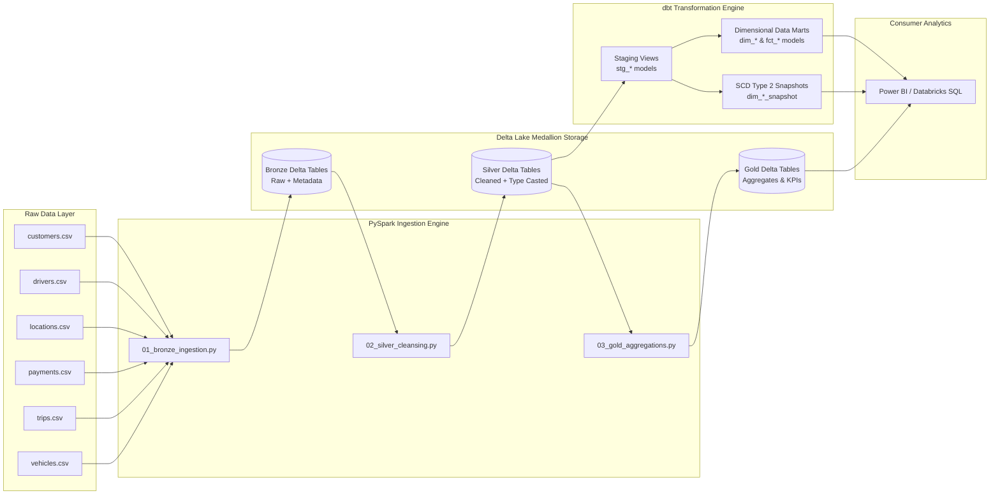

# 🚗 PySpark x dbt End-to-End Data Engineering Project: Urban Mobility Lakehouse Platform

[](https://databricks.com/)
[](https://spark.apache.org/)
[](https://www.getdbt.com/)
[](https://delta.io/)

This repository contains a **production-grade Data Engineering project** built using **PySpark**, **dbt Core**, and **Databricks**, based on the tutorial by **Ansh Lamba**. The platform models an end-to-end **Urban Mobility & Ride Analytics** architecture processing transactional data across 6 relational domain entities (`trips`, `customers`, `drivers`, `payments`, `vehicles`, `locations`).

---

## 🏗️ Architecture & Medallion Design Pattern

The pipeline implements the **Medallion Architecture** (Bronze ➔ Silver ➔ Gold):



---

## 🎯 Key Technical Capabilities Demonstrated

1. **PySpark Data Ingestion & Delta Bronze Layer**:
   - Explicit `StructType` schema enforcement during raw CSV ingestion.
   - Metadata enrichment including ingestion timestamps (`_ingested_at`) and source file tracking (`_source_file`).
2. **Data Cleansing & Transformation (Silver Layer)**:
   - String normalization (trimming, lowercasing email formats, phone number digits extraction).
   - Primary key deduplication and null handling.
   - Derived column engineering (trip duration in minutes, cost per km).
3. **dbt Core Data Modeling**:
   - **Staging Layer**: Clean, 1:1 view mappings over Silver tables.
   - **Dimensional Marts**: Star Schema dimension tables (`dim_customers`, `dim_drivers`, `dim_vehicles`, `dim_locations`).
   - **Fact Tables**: Transactional fact tables (`fct_trips`, `fct_payments`) for revenue and ride duration analysis.
   - **Analytical Marts**: Business aggregation models (`monthly_driver_performance`, `customer_cohort_analytics`).
4. **Slowly Changing Dimensions (SCD Type 2)**:
   - dbt Snapshots tracking historical changes in driver ratings, vehicle assignments, and customer profiles using the `timestamp` strategy.
5. **Data Quality & Governance**:
   - Automated dbt data quality assertions (`unique`, `not_null`, referential integrity `relationships`).

---

## 📂 Repository Directory Structure

```
PySpark_DBT_Project/
├── datasets/                           # Raw CSV transactional datasets
│   ├── customers.csv
│   ├── drivers.csv
│   ├── locations.csv
│   ├── payments.csv
│   ├── trips.csv
│   └── vehicles.csv
├── pyspark_pipeline/                   # PySpark Medallion Architecture Scripts
│   ├── __init__.py
│   ├── spark_session.py                # PySpark Session builder with Delta configs
│   ├── 01_bronze_ingestion.py          # CSV -> Delta Bronze Ingestion
│   ├── 02_silver_cleansing.py          # Bronze -> Silver Cleansing & Enrichment
│   └── 03_gold_aggregations.py         # Silver -> Gold Aggregations & KPIs
├── dbt_project/                        # dbt Core Data Modeling Project
│   ├── dbt_project.yml                 # dbt Project configuration
│   ├── profiles.yml.example            # Sample profiles for Databricks / Spark / DuckDB
│   ├── models/
│   │   ├── staging/                    # Staging views (stg_customers, stg_drivers, etc.)
│   │   │   └── schema.yml              # Staging data quality assertions
│   │   └── marts/                      # Dimensional Marts & Fact Tables
│   │       ├── dim_customers.sql
│   │       ├── dim_drivers.sql
│   │       ├── dim_vehicles.sql
│   │       ├── dim_locations.sql
│   │       ├── fct_trips.sql
│   │       ├── fct_payments.sql
│   │       ├── monthly_driver_performance.sql
│   │       ├── customer_cohort_analytics.sql
│   │       └── schema.yml              # Mart tests & schema definitions
│   └── snapshots/                      # Slowly Changing Dimensions (SCD Type 2)
│       ├── dim_drivers_snapshot.sql
│       └── dim_customers_snapshot.sql
├── run_pipeline.py                     # Pipeline Orchestrator & Runner
└── README.md                           # Documentation & Interview Talking Points Guide
```

---

## 🚀 How to Run the Pipeline

### 1. PySpark Medallion Pipeline Execution
Run the PySpark ingestion and transformation steps:
```bash
python3 -m pyspark_pipeline.01_bronze_ingestion
python3 -m pyspark_pipeline.02_silver_cleansing
python3 -m pyspark_pipeline.03_gold_aggregations
```

### 2. dbt Core Transformation & Testing
Navigate to the `dbt_project` folder and execute dbt:
```bash
cd dbt_project
dbt run
dbt test
dbt snapshot
```

### 3. Unified Orchestrator Script
Run the entire end-to-end pipeline and print executive summary reports:
```bash
python3 run_pipeline.py
```

---

## 💡 Interview Talking Points Guide

When explaining this project to interviewers, highlight:
- **Architecture**: *"I built an end-to-end Medallion Data Lakehouse platform processing ride-sharing data using PySpark for raw ingestion and dbt for dimensional modeling."*
- **Data Engineering Practices**: *"I enforced explicit schemas on read, added ingestion lineage metadata, cleansed messy phone/email records, and deduplicated primary keys before writing clean Parquet/Delta tables."*
- **dbt Modeling**: *"I structured dbt models using a modular approach: Staging views ➔ Star Schema Dimensions & Fact tables ➔ Business Aggregation Marts."*
- **SCD Type 2**: *"I implemented dbt snapshots using timestamp strategy to maintain complete historical track records of driver ratings and customer profiles over time."*
- **Data Governance**: *"I wrote automated dbt data quality tests ensuring zero null primary keys, unique constraints, and foreign key referential integrity."*

---

**Original Tutorial Reference**: [Ansh Lamba - PYSPARK X DBT End-To-End Data Engineering Project](https://youtu.be/cq7Uv7ctGjw)
